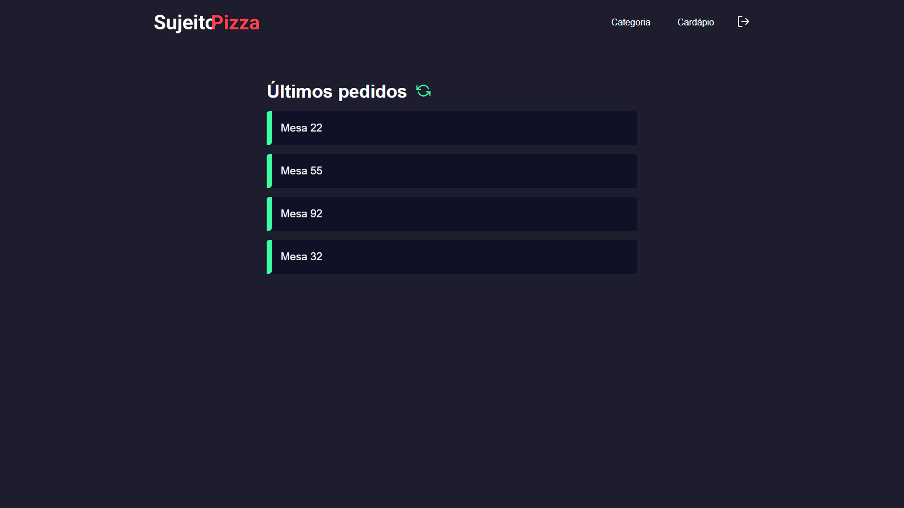

 <p align='center'></p>

## 🚀 Tecnologias
Esse projeto está utilizando as seguintes tecnologias:


- [React](https://pt-br.reactjs.org/)
- [Node](https://nodejs.org/en/)
- [Typescript](https://www.typescriptlang.org/)
- [Next](https://nextjs.org//)
- [React-Native](https://reactnative.dev/)


## ⚙️ Funcionalidades
- Sistema de cadastro e login de usuários;
- Criar novas categorias;
- Listar produtos por categoria;
- Cadastrar novos produtos;
- Envio de imagem para logo do produto;
- Deletar produto;
- Criar uma ordem e adicionar pedidos;

## 🎲 Como utilizar
### Clone esse repositório
```bash
git clone https://github.com/vinizer4/SujeitoPizza.git

```
### Navegue até o diretório backend
```bash
cd backend
```

### Instale as dependências
```bash
npm i
```
```bash
yarn
```

### Inicie o servidor
```bash
yarn dev
npm run dev
```

### Navegue até o diretório frontend
```bash
cd frontend
```

### Instale as dependências
```bash
npm i
```
```bash
yarn
```
### Inicie a aplicação Web
```bash
yarn dev
npm run dev
```

## 🖼️ Layout



---
<p>Criado com 💙 por <a href='https://github.com/vinizer4/' target='_blank'>Vinícius Teixeira Saraiva</a></p>


